```
// 用户信息表
type UserInfo struct {
	Id            int64          `gorm:"column: id;primarykey;comment: 自增id"`
	Uuid          string         `gorm:"column: uuid;uniqueIndex;type: char(20);comment: 用户唯一id"` // 用于唯一标识userinfo
	Nickname      string         `gorm:"column: nickname;type: varchar(20);not null;comment: 昵称"`
	Telephone     string         `gorm:"column: telephone;type: varchar(11);index;not null;comment: 电话"`
	Email         string         `gorm:"column: email;type: char(30);comment: 邮箱"`
	Avatar        string         `gorm:"column: avatar;type: char(255);default:https://cube.elemecdn.com/0/88/03b0d39583f48206768a7534e55bcpng.png;not null;comment:头像"`
	Gender        int8           `gorm:"column: gender;comment:性别, 0.male, 1.female"`
	Signature     string         `gorm:"column: signature;type: varchar(100);comment: 个性签名"`
	Password      string         `gorm:"column: password;type: varchar(18);not null;comment: 密码"`
	Birthday      string         `gorm:"column: birthday;type: varchar(8);comment: 生日"`
	CreatedAt     time.Time      `gorm:"column: created_at;index;type: datetime;not null;comment: 创建时间"`
	DeletedAt     gorm.DeletedAt `gorm:"column: deleted_at;type: datetime;comment: 删除时间"` // gormframe 软删除
	LastOnlineAt  sql.NullTime   `gorm:"column: last_online_at;type: datetime;comment: 上次登录时间"`
	LastOfflineAt sql.NullTime   `gorm:"column: last_offline_at;type: datetime;comment: 最近离线时间"`
	IsAdmin       int8           `gorm:"column: is_admin;not null;comment: 是否为管理员 0.no 1.yes"`
	Status        int8           `gorm:"column: status;index;not null;comment: 状态 0.正常 1.禁用"`
}
```

```
// 用户与其他联系的状态表
type UserContact struct {
	Id          int64          `gorm:"column: id;primaryKey;comment: 自增id"`
	UserId      string         `gorm:"column: user_id;index;type: char(20);not null;comment: 用户唯一id"`
	ContactId   string         `gorm:"column: contact_id;index;type: char(20);not null;comment: 对应联系id"`
	ContactType int8           `gorm:"column: contact_type;not null;comment: 联系类型,0.用户,1.群聊"`
	Status      int8           `gorm:"column: status;not null;comment: 联系状态, 0.正常,1.拉黑,2.被拉黑,3.删除好友,4.被删除好友,5.被禁言,6.退出群聊,7.被提出群聊"`
	CreatedAt   time.Time      `gorm:"column: created_at;type: datetime;not null;comment: 创建时间"`
	UpdateAt    time.Time      `gorm:"column: update_at;type: datetime;not null;comment: 更新时间"`
	DeletedAt   gorm.DeletedAt `gorm:"column: deleted_at;type: datetime;index;comment: 删除时间"`
}
```

```
// 群组信息表
type GroupInfo struct {
	Id        int64           `gorm:"column: id;primaryKey;comment: 自增id"`
	Uuid      int64           `gorm:"column: uuid;uniqueIndex;type: varchar(20);not null;comment: 唯一标识"`
	Name      string          `gorm:"column: name;type: varchar(20);not null;comment: 群组名字"`
	Notice    string          `gorm:"column: notice;type: varchar(500);comment: 群公告"`
	Members   json.RawMessage `gorm:"column: members;type: json;comment: 群组成员"`
	MemberCnt int             `gorm:"column: menber_cnt;default:1;comment: 群人数"` // 默认群主一人
	OwnerId   string          `gorm:"column: owner_id;type: char(20);not null;comment: 群主uuid"`
	AddMode   int8            `gorm:"column: add_mode;default:0;comment: 加群方式, 0.直接,1.审核"`
	Avatar    string          `gorm:"column: avatar;type:char(255);default:https://cube.elemecdn.com/0/88/03b0d39583f48206768a7534e55bcpng.png;not null;comment:头像"`
	Status    int8            `gorm:"column: status;default: 0;comment: 状态, 0.正常,1.禁用,2.解散"`
	CreatedAt time.Time       `gorm:"column: created_at;index;type: datetime;not null;comment: 创建时间"`
	UpdateAt  time.Time       `gorm:"column: update_at;type: datetime;not null;comment: 更新时间"`
	DeletedAt gorm.DeletedAt  `gorm:"column: deleted_at;index;comment:删除时间"`
}
```

```
// 添加联系申请表
type ContactApply struct {
	Id          int64          `gorm:"column: id;primaryKey;comment: 自增id"`
	Uuid        string         `gorm:"column: uuid;uniqueIndex;type: char(20);comment: 申请id"`
	UserId      string         `gorm:"column: user_id;index;type: char(20);not null;comment: 申请人id"`
	ContactId   string         `gorm:"column: contact_id;index;type: char(20);not null;comment: 被申请Id"`
	ContactType int8           `gorm:"column: contact_type;not null;comment: 被申请类型, 0.用户,1.群聊"`
	Status      int8           `gorm:"column: status;not null;comment: 申请状态,0.申请中,1.通过,2.拒绝,3.拉黑"`
	Message     string         `gorm:"column: message;type: varchar(100);comment: 申请信息"`
	LastApplyAt time.Time      `gorm:"column: last_apply_at;type: datetime;not null;comment: 最后申请时间"`
	DeletedAt   gorm.DeletedAt `gorm:"column: deleted_at;index;type: datetime;comment: 删除时间"`
}
```

```
// 会话信息表
type Session struct {
	Id            int64          `gorm:"column: id;primaryKey;comment: 自增id"`
	Uuid          int64          `gorm:"column: uuid;uniqueIndex;type: char(20);not null;comment: 会话uuid"`
	SendId        string         `gorm:"column: send_id;Index;type: char(20);not null;comment: 创建会话人id"`    // 用户类型
	ReceiveId     string         `gorm:"column: receive_id;Index;type: char(20);not null;comment: 接受会话人id"` // 用户或者群聊类型
	ReceiveName   string         `gorm:"column: receive_name;type: char(20);not null;comment: 名称"`
	Avatar        string         `gorm:"column: avatar;type: char(255);default:avatar.png;not null;comment:头像"`
	LastMessage   string         `gorm:"column: last_message;type: TEXT;comment: 最新消息"`
	LastMessageAt sql.NullTime   `gorm:"column: last_message_at;type: datetime;comment: 最近接收时间"`
	CreatedAt     time.Time      `gorm:"column: created_at;Index;type: datetime;not null;comment: 创建时间"`
	DeletedAt     gorm.DeletedAt `gorm:"column: deleted_at;Index;type: datetime;comment: 删除时间"`
}
```

```
// 传输信息表
type Message struct {
	Id         int64        `gorm:"column:id;primaryKey;comment:自增id"`
	Uuid       string       `gorm:"column:uuid;uniqueIndex;type:char(20);not null;comment:消息uuid"`
	SessionId  string       `gorm:"column:session_id;index;type:char(20);not null;comment:会话uuid"`
	Type       int8         `gorm:"column:type;not null;comment:消息类型: 0-文本,1-语音,2-文件,3-通话"` // 通话不用存消息内容或者url
	Content    string       `gorm:"column:content;type:TEXT;comment:消息内容"`
	Url        string       `gorm:"column:url;type:char(255);comment:消息url"`
	SendId     string       `gorm:"column:send_id;index;type:char(20);not null;comment:发送者uuid"`
	SendName   string       `gorm:"column:send_name;type:varchar(20);not null;comment:发送者昵称"`
	SendAvatar string       `gorm:"column:send_avatar;type:varchar(255);not null;comment:发送者头像"`
	ReceiveId  string       `gorm:"column:receive_id;index;type:char(20);not null;comment:接受者uuid"`
	FileType   string       `gorm:"column:file_type;type:char(10);comment:文件类型"`
	FileName   string       `gorm:"column:file_name;type:varchar(50);comment:文件名"`
	FileSize   string       `gorm:"column:file_size;type:char(20);comment:文件大小"`
	Status     int8         `gorm:"column:status;not null;comment:状态: 0-未发送,1-已发送"`
	CreatedAt  time.Time    `gorm:"column:created_at;not null;comment:创建时间"`
	SendAt     sql.NullTime `gorm:"column:send_at;comment:发送时间"`
	AVdata     string       `gorm:"column:av_data;comment:通话传递数据"`
}
```

表间关系
UserInfo (用户信息表)
    核心实体，通过 Uuid 与其他所有表产生关联。
    与 GroupInfo：1 对 N 关系（一个用户可以作为 OwnerId 创建多个群）。
UserContact (联系人状态表)
    中间关联表，处理“用户与用户(好友)”以及“用户与群组(群成员)”的关系。
    通过 ContactType (0或1) 决定 ContactId 是指向 UserInfo.Uuid 还是 GroupInfo.Uuid（这种设计叫多态关联）。
GroupInfo (群组信息表)
    独立的群实体，通过 OwnerId 关联到群主（UserInfo）。
    它的成员关系一方面可以通过自身的 Members (JSON字段) 冗余存储，另一方面主要通过 UserContact 表维护。
ContactApply (联系申请表)
    流程流转表，记录加好友或加群的申请。
    UserId 是发起方，ContactId 是接收方（同样通过 ContactType 区分是用户还是群聊）。
Session (会话表)
    记录用户当前的聊天窗口。
    SendId 为会话所属的用户，ReceiveId 为聊天的对象（单聊为对方用户 UUID，群聊为群组 UUID）。
Message (消息表)
    具体的消息明细，1个 Session 对应 N 条 Message（通过 SessionId 关联）。
    SendId 关联发送方（UserInfo），ReceiveId 关联接收方。

E-R图

```
erDiagram
    %% 实体关系定义

    USER_INFO ||--o{ USER_CONTACT : "作为所属人关联 (UserId)"
    USER_INFO ||--o{ USER_CONTACT : "被添加为好友 (ContactId, Type=0)"
    USER_INFO ||--o{ GROUP_INFO : "创建并拥有群聊 (OwnerId)"
    USER_INFO ||--o{ CONTACT_APPLY : "发起好友/加群申请 (UserId)"
    USER_INFO ||--o{ CONTACT_APPLY : "接收好友申请 (ContactId, Type=0)"
    USER_INFO ||--o{ SESSION : "拥有会话窗口 (SendId)"
    USER_INFO ||--o{ MESSAGE : "发送消息 (SendId)"

    GROUP_INFO ||--o{ USER_CONTACT : "包含群成员 (ContactId, Type=1)"
    GROUP_INFO ||--o{ CONTACT_APPLY : "接收加群申请 (ContactId, Type=1)"
    GROUP_INFO ||--o{ SESSION : "作为会话接收方 (ReceiveId)"

    SESSION ||--o{ MESSAGE : "包含多条聊天记录 (SessionId)"

    %% 实体字段定义
    USER_INFO {
        int64 id PK "自增主键"
        string uuid UK "用户唯一ID"
        string nickname "昵称"
        string telephone "电话"
        string email "邮箱"
        int8 gender "性别"
        int8 is_admin "是否管理员"
        int8 status "状态"
    }

    GROUP_INFO {
        int64 id PK "自增主键"
        int64 uuid UK "群组唯一ID"
        string name "群组名称"
        string owner_id FK "群主UUID (->UserInfo)"
        int member_cnt "群人数"
        int8 add_mode "加群方式"
        int8 status "状态"
    }

    USER_CONTACT {
        int64 id PK "自增主键"
        string user_id FK "用户UUID (->UserInfo)"
        string contact_id FK "联系人/群UUID (多态关联)"
        int8 contact_type "联系类型(0用户,1群聊)"
        int8 status "联系状态(正常,拉黑等)"
    }

    CONTACT_APPLY {
        int64 id PK "自增主键"
        string uuid UK "申请唯一ID"
        string user_id FK "申请人UUID (->UserInfo)"
        string contact_id FK "被申请UUID (多态关联)"
        int8 contact_type "被申请类型(0用户,1群聊)"
        int8 status "申请状态"
        string message "申请验证信息"
    }

    SESSION {
        int64 id PK "自增主键"
        int64 uuid UK "会话唯一ID"
        string send_id FK "所属用户UUID (->UserInfo)"
        string receive_id FK "接收方UUID (多态关联)"
        string receive_name "接收方名称"
        string last_message "最新消息内容"
    }

    MESSAGE {
        int64 id PK "自增主键"
        string uuid UK "消息唯一ID"
        string session_id FK "会话UUID (->Session)"
        string send_id FK "发送者UUID (->UserInfo)"
        string receive_id FK "接收者UUID (多态关联)"
        int8 type "消息类型(文本/语音/文件等)"
        string content "消息体内容"
        int8 status "发送状态"
    }
```



